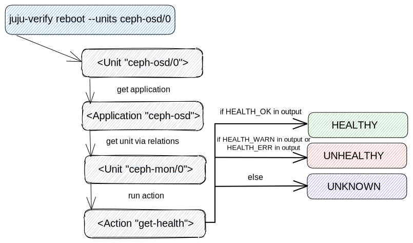
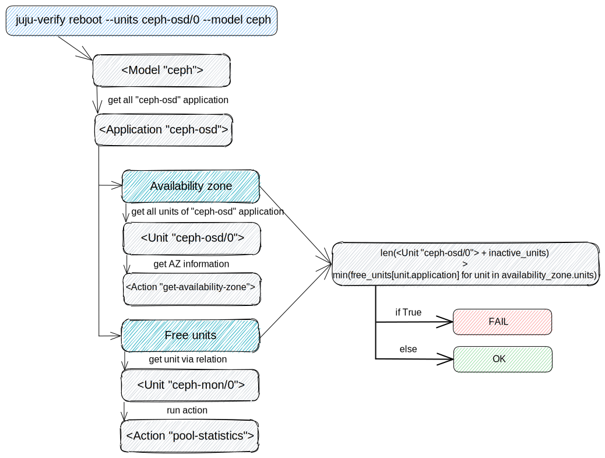

Ceph-osd verifier
=================

So far, the "reboot" and "shutdown" actions are supported and they both
perform the same set of checks.

* check Ceph clusters health
* check the minimum number of replicas
* check availability zones resources

check Ceph clusters health
--------------------------

This check maps `ceph-osd` applications part of the `--units` argument and the
first `ceph-mon` unit obtained from the relations. The `get-health` action is
run on each of the `ceph-mon` units to determine if the cluster(s) the unit(s)
are part of are healthy (Note: if more than one Ceph cluster exists, verified
`ceph-osd` units may be part of more than one cluster). A cluster is
considered healthy if the action's output contains HEALTH_OK.

check the minimum number of replicas
------------------------------------

While the previous check creates a unique set of "ceph-mon" units from the
map, this one goes through each item, calling the "list-pools" action with
the "format=json" option to get minimum replication number for each "ceph-mon"
unit.

 The replication number for each pool is calculated as the pool size minus the
 minimum pool size. If no group is available, the replication number is
 returned as None and the check for that application ends successfully.

The next step is to calculate the number of units for each application to be
removed/shutdown, plus the number of units are in an inactive workload status.
Such a number is compared to the minimum replication number, and if it's
greater, the check fails.

.. image:: check_replication_number.svg

check availability zones resources
----------------------------------

The prerequisite for this check is to obtain all "ceph-osd" applications in
the model, not just those that include verification units. For each
application, it is necessary to obtain the number of free units based on the
storage usage and information in which availability zone they are located.

* The number of free units is parsed from the "ceph df" output, which provides
  storage usage information for each pool. The minimum value is selected from
  all obtained numbers.

.. todo:: There is a bug `LP#1921121`_ that describes the "pool-statistics"
   used to calculate storage usage information. This approach should be
   properly verified.

* Availability zone information is obtained using the "get-availability-zone"
  action, which is called for each unit belonging to any "ceph-osd"
  application.

For each availability zone, the number of inactive units plus the number of
units to be removed/shutdown is then counted. Such a number is comparable to
the minimum number of free units for each application in the availability
zones, as there can be several applications in one availability zone, and if
it is greater than the check failed.

.. _LP#1921121: https://bugs.launchpad.net/juju-verify/+bug/1921121
