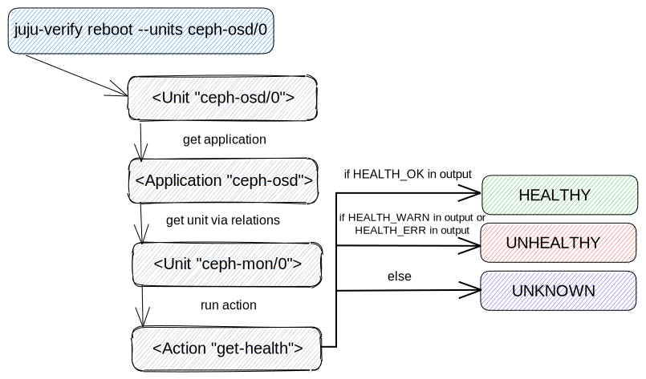
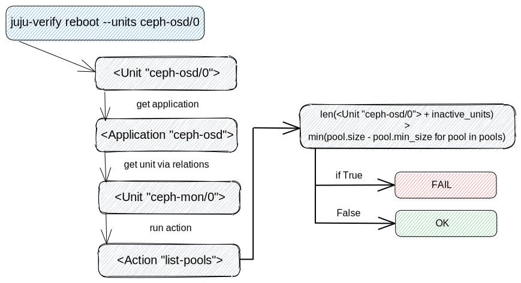
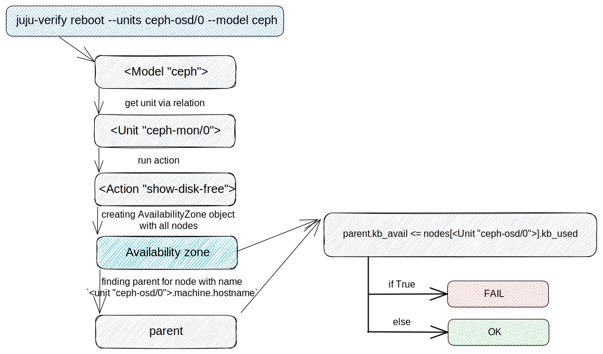

Ceph-osd verifier
=================

So far, the "reboot" and "shutdown" actions are supported and they both
perform the same set of checks.

* check Ceph clusters health
* check the minimum number of replicas
* check availability zones resources

.. _check Ceph cluster health:

check Ceph clusters health
--------------------------

This check maps ``ceph-osd`` applications part of the ``--units`` argument and the
first ``ceph-mon`` unit obtained from the relations. The ``get-health`` action is
run on each of the ``ceph-mon`` units to determine if the cluster(s) the unit(s)
are part of are healthy (Note: if more than one Ceph cluster exists, verified
``ceph-osd`` units may be part of more than one cluster). A cluster is
considered healthy if the action's output contains HEALTH_OK.

check the minimum number of replicas
------------------------------------

While the previous check creates a unique set of "ceph-mon" units from the
map, this one goes through each item, calling the "list-pools" action with
the "format=json" option to get minimum replication number for each "ceph-mon"
unit.

The replication number for each pool is calculated as the pool size minus the
minimum pool size. If no group is available, the replication number is
returned as None and the check for that application ends successfully.

The next step is to calculate the number of units for each application to be
removed/shutdown, plus the number of units are in an inactive workload status.
Such a number is compared to the minimum replication number, and if it's
greater, the check fails.

check availability zones resources
----------------------------------

This check will obtain a ``ceph-mon`` unit in same way as the
:ref:`check Ceph cluster health`. Subsequently, the action ``show-disk-free`` is run
on this unit with expected output containing ``nodes``, ``stray`` and ``summary`` keys.
The key ``nodes`` is used to provide information about each node space usage in
the tree form.
Example:

::

  {
    "nodes": [
        {
            "id": -1,
            "name": "default",
            "type": "root",
            "type_id": 10,
            "kb": 4706304,
            "kb_used": 3200640,
            "kb_avail": 1505664,
            ...,
            "children": [
                -7,
                -3,
                -5
            ]
        },
        {
          "id": -5,
          "name": "juju-1234-ceph-0",
          "type": "host",
          "type_id": 1,
          "kb": 1568768,
          "kb_used": 1066880,
          "kb_avail": 501888,
          ...,
          "children": [
              2
          ]
      },
      ...,

    ],
    "stray": [],
    "summary": {
        "total_kb": 4706304,
        "total_kb_used": 3200640,
        "total_kb_used_data": 54720,
        "total_kb_used_omap": 154,
        "total_kb_used_meta": 3145573,
        "total_kb_avail": 1505664,
        "average_utilization": 68.007507,
        "min_var": 1.000000,
        "max_var": 1.000000,
        "dev": 0.000000
    }
  }

The availability zone is created based on these nodes, where each node can be described
as follows (only the parts used are described):

 - ``id`` - node ID
 - ``name`` - node name
 - ``type`` - Ceph `CRUSH Maps type`_
   the machine hostname matches the names for the type=host
 - ``type_id`` - Ceph `CRUSH Maps type`_ ID
   used to arrange nodes in a string representation of an availability zone
 - ``kb`` - total space size
 - ``kb_used`` - total used space size
 - ``kb_avail`` - total available (free) space size
 - ``children`` - list of child node IDs

To properly determine if the unit can be shutdown/restart it's a comparison of
free space on the parent node with the size of the used space on the node.
Let's show this using the previous example of ``show-disk-free`` action output:

  - verify that the ``juju-1234-ceph-0`` unit can be shutdown/restart
  - the unit uses a total of 1066880 kb space
  - parent with ID -1, who has the unit among his children, has 1505664 kb free space
  - it's safe to shutdown/restart the unit, because data from it could be transferred
    to another unit (1505664 > 1066880)

.. _CRUSH Maps type: https://docs.ceph.com/en/latest/rados/operations/crush-map/#types-and-buckets
